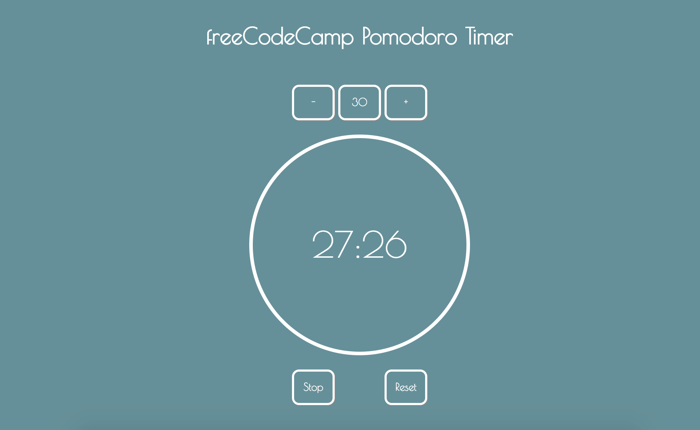

# JavaScript Timer

This is my implementation of the second freeCodeCamp Advanced Challenge.

The application has an inbuilt timer which you can adjust by using the "+" and "-" buttons. You can also stop the timer and reset the timer by using the buttons provided. The timer will make a beeping noise once the time has elapsed so you know when your timer has elapsed.

You can access the timer at the following
https://alaskaa.github.io/fcc-timer

